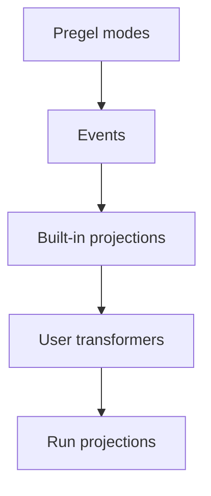

Event streaming is the recommended in-process streaming model for most LangGraph application code. It returns a run stream object that can be consumed in multiple ways at the same time.


```ts
const run = await graph.streamEvents(
  { messages: [{ role: "user", content: "What is 42 * 17?" }] },
  { version: "v3" }
);

for await (const message of run.messages) {
  for await (const token of message.text) {
    process.stdout.write(token);
  }
}

const finalState = await run.output;
```


<Note>
  The `version="v3"` flag is temporarily required to opt in to this stream behavior. The new behavior will become the default stream version in the next major LangGraph release.
</Note>

To stream against a graph deployed behind an Agent Server, see the [LangSmith Streaming API](/langsmith/streaming).

## What Event streaming provides

The run stream exposes typed projections over one underlying event flow:

| Projection | Use |
| ---------- | --- |
| `run` | Iterate every protocol event. |
| `run.messages` | Stream chat model messages and token deltas. |
| `run.values` | Iterate state snapshots and await the final value. |
| `run.output` | Await the final output. |
| `run.subgraphs` | Discover and observe nested graph executions. |
| `run.interrupts` | Inspect human-in-the-loop interrupt payloads. |
| `run.interrupted` | Check whether the run paused for human input. |
| `run.extensions` | Consume custom stream transformer projections. |

Multiple consumers can read these projections concurrently. Reading `run.messages` does not consume events needed by `run.values`, `run.subgraphs`, or `run.output`.

## Stream all protocol events

Use the run object itself when you want the raw protocol event stream:


```ts
const run = await graph.streamEvents(
  { messages: [{ role: "user", content: "What is 42 * 17?" }] },
  { version: "v3" }
);

for await (const event of run) {
  const namespace = event.params.namespace;
  console.log(namespace, event.method, event.params.data);
}
```


Each event has a channel-like `method`, a `seq` number, and `params` containing `namespace`, `timestamp`, optional `node`, and channel-specific `data`.

The `namespace` is a path from the root graph to the scope that emitted the event. The root is the empty array `[]`. Each child execution adds one `"name:runtime_id"` segment, so a nested tool call inside a subgraph looks like `["researcher:6f4d", "tools:91ac"]`. The name before `:` is the stable graph or node name; the suffix is a per-invocation runtime ID. Filter raw events by namespace yourself when you only care about a specific subtree — `run.subgraphs` already does this for nested graph executions.


## Channels and event lifecycle

Raw events flow on channels. The channel name appears as the event's `method`; each channel emits a specific event shape.

| Channel | Purpose |
| ------- | ------- |
| `values` | Full graph state snapshots. |
| `updates` | Per-node state deltas. |
| `messages` | Content-block-centric chat model output. |
| `tools` | Tool call start, streamed output, finish, and error events. |
| `lifecycle` | Run, subgraph, and subagent status changes. |
| `checkpoints` | Lightweight checkpoint envelopes for branching and time travel. |
| `input` | Human-in-the-loop input requests and responses. |
| `tasks` | Pregel task creation and result events. |
| `custom` | User-defined payloads from graph code. |
| `custom:<name>` | Application-defined stream transformer output. |

The typed projections (`run.messages`, `run.values`, etc.) are built from these channels. The channel name appears as the `method` field on raw events when you iterate the run object directly.

### Message lifecycle

The `messages` channel models output as content blocks:

```text
message-start
content-block-start
content-block-delta
content-block-finish
message-finish
```

Content blocks have explicit boundaries: a block starts, emits zero or more deltas, and finishes before the next block in the same message starts. This makes token streaming, reasoning blocks, tool-call blocks, and multimodal content explicit without requiring provider-specific formats. `message-finish` may include token usage; unrecoverable model-call failures arrive as message error events.

### Tool lifecycle

The `tools` channel exposes tool execution:

```text
tool-started
tool-output-delta
tool-finished
tool-error
```

Tool events are correlated by tool call ID, so a tool execution can be joined back to its originating tool-call content block on the `messages` channel.

### Run lifecycle

The `lifecycle` channel tracks root run, subgraph, and subagent status. Status values:

- `started`
- `running`
- `completed`
- `failed`
- `interrupted`

Each lifecycle event carries a `namespace`, optional graph name, optional error, optional checkpoint, and optional `cause` explaining why a child namespace started (parent tool call, fan-out send, edge transition). Consumers should tolerate unknown causes so the protocol can add new variants without breaking existing clients.

## Stream messages

Use `run.messages` for chat model output:


```ts
const run = await graph.streamEvents(input, { version: "v3" });

for await (const message of run.messages) {
  const text = await message.text;
  const usage = await message.usage;

  console.log(text);
  console.log(usage);
}
```


`message.text` is both an async iterable and a promise-like value. Iterate it for token-by-token output, or await it for the complete text.


## Stream subgraphs

Use `run.subgraphs` to observe nested graph work without parsing namespace strings:


```ts
const run = await graph.streamEvents(input, { version: "v3" });

for await (const subgraph of run.subgraphs) {
  console.log(subgraph.name, subgraph.path);

  for await (const message of subgraph.messages) {
    console.log(await message.text);
  }
}
```


For product-specific streams, see [Deep Agents streaming](/oss/javascript/deepagents/event-streaming) for subagent streams and [LangChain agent streaming](/oss/javascript/langchain/streaming) for tool calls and middleware events.

## Stream state

Use `run.values` to stream full state snapshots after each step:


```ts
const run = await graph.streamEvents(input, { version: "v3" });

for await (const snapshot of run.values) {
  console.log(snapshot);
}

const finalState = await run.output;
```


## Stream multiple projections


Use concurrent consumers when you need multiple projections in JavaScript:

```ts
await Promise.all([
  (async () => {
    for await (const message of run.messages) {
      console.log(await message.text);
    }
  })(),
  (async () => {
    for await (const subgraph of run.subgraphs) {
      console.log(subgraph.path);
    }
  })(),
]);
```


## Add custom projections

Custom stream transformers can add application-specific projections under `run.extensions`:


```ts
const run = await graph.streamEvents(input, {
  version: "v3",
  transformers: [statsTransformer, toolActivityTransformer],
});

for await (const activity of run.extensions.toolActivity) {
  console.log(activity);
}

console.log(await run.extensions.totalTokens);
```


See [Build your own projection](#build-your-own-projection) for the transformer contract.

## Resume after an interrupt

When a graph pauses for human input, inspect `run.interrupted` and `run.interrupts`, then resume by calling `stream_events(..., version="v3")` again with `Command`.


## Relationship to Pregel streaming

Event streaming and Pregel streaming serve different levels of the stack. Use [Pregel streaming](/oss/javascript/langgraph/streaming) when you need low-level Pregel stream modes or access to LangGraph internals. Use Event streaming (`stream_events(..., version="v3")`) when application code benefits from typed projections.

## Build your own projection

The remaining sections are for application or library code that needs a projection the built-in transformers do not provide. Most readers can stop here.

Stream transformers are the projection layer in Event streaming. They observe protocol events, keep their own state, and expose derived views of a run such as messages, tool calls, subgraphs, tool activity, token totals, progress events, artifacts, or third-party protocol messages. `StreamChannel` is the projection primitive transformers use to publish those views.

### How transformers work

Event streaming starts with Pregel streaming output from the LangGraph Pregel engine. The runtime normalizes those chunks into protocol events, then a stream handler routes each event through a stack of stream transformers.



The stream handler is the central dispatcher for one run. For every protocol event, it:

1. Calls each registered transformer's `process(event)` hook in order.
2. Wires named `StreamChannel` pushes back onto the protocol event stream.
3. Stores the event in the run stream unless a transformer suppresses it.
4. Calls `finalize()` or `fail()` on every transformer when the run ends.

Transformers are observational. They do not call back into the graph runtime. Instead, they consume events and push derived values into `StreamChannel`, promises, or other projection objects.

### When to write one


User transformers are the public extension point for Event streaming. They let application or third-party code observe protocol events and expose derived data under `run.extensions.<name>`.


Use a user transformer when the built-in projections do not match the shape your application needs. For example, a transformer can publish tool activity, token totals, progress events, artifacts, or messages for another protocol.

### Transformer shape

A transformer implements the `StreamTransformer` interface:


```ts
interface StreamTransformer<TProjection = unknown> {
  init(): TProjection;
  process(event: ProtocolEvent): boolean;
  finalize?(): void | PromiseLike<void>;
  fail?(err: unknown): void;
}
```


- `init()` creates the projection object. User transformer projections appear under `run.extensions`.
- `process()` observes each protocol event. Return `false` only when you intentionally want to suppress the original event.
- `finalize()` closes or resolves non-channel projections after a successful run.
- `fail()` propagates errors to non-channel projections.

### StreamChannel

`StreamChannel` is the projection primitive a transformer uses for streaming values. It always exposes an iterable stream on `run.extensions.<name>`. The constructor argument decides whether each `push()` also flows into the run's main event stream as a `custom:<name>` event—that is, whether the projection's values show up when iterating raw protocol events.

| Need | Use |
| ---- | --- |
| Side-channel projection only | `new StreamChannel<T>()` |
| Also flow each push into the main event stream | `new StreamChannel<T>(name)` |


Named channel payloads must be serializable, because each pushed value also becomes a `custom:<name>` protocol event in the main stream. Keep promises, async iterables, class instances, and other in-process handles in unnamed channels.

The stream handler owns channel lifecycle. Once `init()` returns a channel, the handler closes or fails it for you when the run ends. Transformers only push values.

### Example: streaming projection

Pass a string name to `StreamChannel` to expose a streaming projection through `run.extensions` *and* forward each pushed value into the run's main event stream as a `custom:<name>` protocol event. Without a name, the channel is a side-channel projection only — accessible on `run.extensions` but not visible to consumers iterating raw events:


```ts
import { StreamChannel } from "@langchain/langgraph";

const toolActivityTransformer = () => {
  const activity = new StreamChannel<{
    name: string;
    status: "started" | "finished" | "error";
  }>("toolActivity");

  return {
    init: () => ({ toolActivity: activity }),
    process(event) {
      if (event.method === "tools") {
        const data = event.params.data as { tool_name?: string; event?: string };
        if (data.tool_name && data.event) {
          activity.push({
            name: data.tool_name,
            status: data.event === "tool-error" ? "error" : "started",
          });
        }
      }
      return true;
    },
  };
};
```


For custom events emitted from graph nodes that should stay off the main event stream, use an unnamed channel:


```ts
import { StreamChannel } from "@langchain/langgraph";

const customTransformer = () => {
  const custom = new StreamChannel<unknown>();

  return {
    init: () => ({ custom }),
    process(event) {
      if (event.method === "custom") {
        custom.push(event.params.data);
      }
      return true;
    },
  };
};
```


### Example: final-value projection

Use unnamed streams, promises, or other in-process objects when the projection should not flow into the main event stream:


```ts
const statsTransformer = () => {
  let totalTokens = 0;
  let resolveTotal!: (value: number) => void;
  const totalTokensPromise = new Promise<number>((resolve) => {
    resolveTotal = resolve;
  });

  return {
    init: () => ({ totalTokens: totalTokensPromise }),
    process(event) {
      if (event.method === "messages") {
        const data = event.params.data as { usage?: { output_tokens?: number } };
        totalTokens += data.usage?.output_tokens ?? 0;
      }
      return true;
    },
    finalize: () => resolveTotal(totalTokens),
  };
};
```


### Register at call time or compile time

Pass transformers at call time for local experimentation:


```ts
const run = await graph.streamEvents(input, {
  version: "v3",
  transformers: [statsTransformer, toolActivityTransformer],
});
```


Compile transformers into the graph when every run of that graph should produce the projection:


```ts
const graph = builder.compile({
  transformers: [statsTransformer, toolActivityTransformer],
});
```

---

<div className="source-links">
<Callout icon="terminal-2">
    [Connect these docs](/use-these-docs) to Claude, VSCode, and more via MCP for real-time answers.
</Callout>
<Callout icon="edit">
    [Edit this page on GitHub](https://github.com/langchain-ai/docs/edit/main/src/oss/langgraph/streaming/event-streaming.mdx) or [file an issue](https://github.com/langchain-ai/docs/issues/new/choose).
</Callout>
</div>
