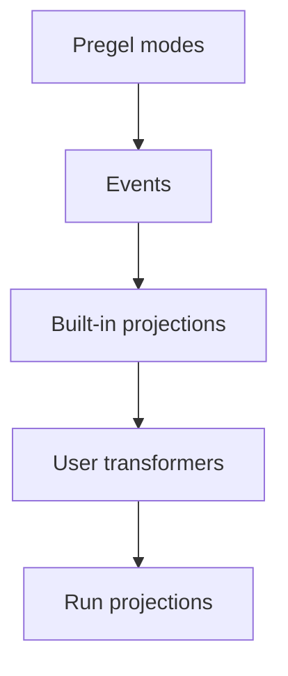

Event streaming is the recommended in-process streaming model for most LangGraph application code. It returns a run stream object that can be consumed in multiple ways at the same time.

```py
run = graph.stream_events({
    "messages": [{"role": "user", "content": "What is 42 * 17?"}],
}, version="v3")

for message in run.messages:
    for token in message.text:
        print(token, end="", flush=True)

final_state = run.output
```


To stream against a graph deployed behind an Agent Server, see the [LangSmith Streaming API](/langsmith/streaming).

## What Event streaming provides

The run stream exposes typed projections over one underlying event flow:

| Projection | Use |
| ---------- | --- |
| `run` | Iterate every protocol event. |
| `run.messages` | Stream chat model messages and token deltas. |
| `run.values` | Iterate state snapshots and await the final value. |
| `run.output` | Await the final output. |
| `run.subgraphs` | Discover and observe nested graph executions. |
| `run.interrupts` | Inspect human-in-the-loop interrupt payloads. |
| `run.interrupted` | Check whether the run paused for human input. |
| `run.extensions` | Consume custom stream transformer projections. |

Multiple consumers can read these projections concurrently. Reading `run.messages` does not consume events needed by `run.values`, `run.subgraphs`, or `run.output`.

Event streaming sits one level above [Pregel streaming](/oss/python/langgraph/streaming), which exposes raw graph execution events through `stream_mode` modes such as `updates`, `values`, `messages`, `custom`, `checkpoints`, `tasks`, and `debug`. Use Pregel streaming when you need low-level access to those modes; use Event streaming when application code benefits from typed projections.

## Stream messages

Use `run.messages` for chat model output:

```py
run = graph.stream_events(input, version="v3")

for message in run.messages:
    text = str(message.text)
    usage = message.output.usage_metadata

    print(text)
    print(usage)
```


`message.text` is iterable in synchronous code. Iterate it for token-by-token output, or call `str(message.text)` for the complete text.

`message.reasoning` exposes reasoning deltas, and `message.tool_calls` exposes tool-call argument chunks. If you need text, reasoning, and tool-call chunks in exact arrival order, iterate the message stream's raw events instead of each projection separately.


## Stream subgraphs

Use `run.subgraphs` to observe nested graph work without parsing namespace strings:

```py
run = graph.stream_events(input, version="v3")

for subgraph in run.subgraphs:
    print(subgraph.name, subgraph.path)

    for message in subgraph.messages:
        print(str(message.text))
```


For product-specific streams, see [Deep Agents streaming](/oss/python/deepagents/event-streaming) for subagent streams and [LangChain agent streaming](/oss/python/langchain/streaming) for tool calls and middleware events.

## Stream state

Use `run.values` to stream full state snapshots after each step:

```py
run = graph.stream_events(input, version="v3")

for snapshot in run.values:
    print(snapshot)

final_state = run.output
```


## Stream multiple projections

Use `run.interleave(...)` to round-robin across multiple projections in synchronous Python code:

```py
for name, item in run.interleave("values", "messages", "subgraphs"):
    if name == "values":
        print(f"[state] keys={list(item)}")
    elif name == "messages":
        print(f"[llm] node={item.node}")
    elif name == "subgraphs":
        print(f"[subgraph] path={item.path}")
```


## Resume after an interrupt

When a graph pauses for human input, inspect `run.interrupted` and `run.interrupts`, then resume by calling `stream_events(..., version="v3")` again with `Command`.

```py
from langgraph.types import Command

run = graph.stream_events(input, version="v3", config=thread_config)

for message in run.messages:
    print(str(message.text))

if run.interrupted:
    print(run.interrupts)

run = graph.stream_events(
    Command(resume={"decisions": [{"type": "approve"}]}),
    version="v3",
    config=thread_config,
)
final_state = run.output
```


## Stream all protocol events

Use the run object itself when you want the raw protocol event stream:

```py
run = graph.stream_events({
    "messages": [{"role": "user", "content": "What is 42 * 17?"}],
}, version="v3")

for event in run:
    namespace = event["params"]["namespace"]
    print(namespace, event["method"], event["params"]["data"])
```


Each event has a channel-like `method`, a `seq` number, and `params` containing `namespace`, `timestamp`, optional `node`, and channel-specific `data`.

The `namespace` is a path from the root graph to the scope that emitted the event. The root is the empty array `[]`. Each child execution adds one `"name:runtime_id"` segment, so a nested tool call inside a subgraph looks like `["researcher:6f4d", "tools:91ac"]`. The name before `:` is the stable graph or node name; the suffix is a per-invocation runtime ID. Filter raw events by namespace yourself when you only care about a specific subtree — `run.subgraphs` already does this for nested graph executions.

## Channels and event lifecycle

Raw events flow on channels. The channel name appears as the event's `method`; each channel emits a specific event shape.

| Channel | Purpose |
| ------- | ------- |
| `values` | Full graph state snapshots. |
| `updates` | Per-node state deltas. |
| `messages` | Content-block-centric chat model output. |
| `tools` | Tool call start, streamed output, finish, and error events. |
| `lifecycle` | Run, subgraph, and subagent status changes. |
| `checkpoints` | Lightweight checkpoint envelopes for branching and time travel. |
| `input` | Human-in-the-loop input requests and responses. |
| `tasks` | Pregel task creation and result events. |
| `custom` | User-defined payloads from graph code. |
| `custom:<name>` | Application-defined stream transformer output. |

The typed projections (`run.messages`, `run.values`, etc.) are built from these channels. The channel name appears as the `method` field on raw events when you iterate the run object directly.

### Messages

The `messages` channel models output as content blocks. The data's `event` field is one of:

- `message-start`
- `content-block-start`
- `content-block-delta`
- `content-block-finish`
- `message-finish`

Content blocks have explicit boundaries: a block starts, emits zero or more deltas, and finishes before the next block in the same message starts. This makes token streaming, reasoning blocks, tool-call blocks, and multimodal content explicit without requiring provider-specific formats. `message-finish` may include token usage; unrecoverable model-call failures arrive as message error events.

To consume raw content-block events directly instead of using the `run.messages` projection:

```py
for event in run:
    if event["method"] != "messages":
        continue

    data = event["params"]["data"]
    if data.get("event") != "content-block-delta":
        continue

    block = data.get("delta") or {}
    if block.get("type") == "text-delta":
        print(block.get("text", ""), end="", flush=True)
    elif block.get("type") == "reasoning-delta":
        print(f"[thinking]{block.get('reasoning', '')}", end="", flush=True)
```


### Tools

The `tools` channel exposes tool execution. The data's `event` field is one of:

- `tool-started`
- `tool-output-delta`
- `tool-finished`
- `tool-error`

Tool events are correlated by tool call ID, so a tool execution can be joined back to its originating tool-call content block on the `messages` channel.

### Lifecycle

The `lifecycle` channel tracks root run, subgraph, and subagent status. The data's `event` field is one of:

- `started`
- `running`
- `completed`
- `failed`
- `interrupted`

Beyond `event`, lifecycle data may include an optional `graph_name`, `error`, and `cause` describing why a child scope started (parent tool call, fan-out send, edge transition).

## Build your own projection

Stream transformers are the projection layer in Event streaming. They observe protocol events, keep their own state, and expose derived views of a run such as messages, tool calls, subgraphs, tool activity, token totals, progress events, artifacts, or third-party protocol messages. `StreamChannel` is the projection primitive transformers use to publish those views.

### How transformers work

Event streaming starts with Pregel streaming output from the LangGraph Pregel engine. The runtime normalizes those chunks into protocol events, then a stream handler routes each event through a stack of stream transformers.



The stream handler is the central dispatcher for one run. For every protocol event, it:

1. Calls each registered transformer's `process(event)` hook in order.
2. Wires named `StreamChannel` pushes back onto the protocol event stream.
3. Stores the event in the run stream unless a transformer suppresses it.
4. Calls `finalize()` or `fail()` on every transformer when the run ends.

Transformers are observational. They do not call back into the graph runtime. Instead, they consume events and push derived values into `StreamChannel`, promises, or other projection objects.

### When to write one

User transformers are the public extension point for Event streaming. They let application or third-party code observe protocol events and expose derived data under `run.extensions["name"]`.


Use a user transformer when the built-in projections do not match the shape your application needs. For example, a transformer can publish tool activity, token totals, progress events, artifacts, or messages for another protocol.

### Transformer shape

A transformer implements the `StreamTransformer` interface:

```py
from langgraph.stream import ProtocolEvent, StreamTransformer


class MyTransformer(StreamTransformer):
    def init(self) -> dict:
        ...

    def process(self, event: ProtocolEvent) -> bool:
        ...

    def finalize(self) -> None:
        ...

    def fail(self, err: BaseException) -> None:
        ...
```


- `init()` creates the projection object. User transformer projections appear under `run.extensions`.
- `process()` observes each protocol event. Return `false` only when you intentionally want to suppress the original event.
- `finalize()` closes or resolves non-channel projections after a successful run.
- `fail()` propagates errors to non-channel projections.

### StreamChannel

`StreamChannel` is the projection primitive a transformer uses for streaming values. It always exposes an iterable stream on `run.extensions.<name>`. The constructor argument decides whether each `push()` also flows into the run's main event stream as a `custom:<name>` event—that is, whether the projection's values show up when iterating raw protocol events.


| Need | Use |
| ---- | --- |
| Side-channel projection only | `StreamChannel()` |
| Also flow each push into the main event stream | `StreamChannel(name)` |


Named channel payloads must be serializable, because each pushed value also becomes a `custom:<name>` protocol event in the main stream. Keep promises, async iterables, class instances, and other in-process handles in unnamed channels.

The stream handler owns channel lifecycle. Once `init()` returns a channel, the handler closes or fails it for you when the run ends. Transformers only push values.

### Example: streaming projection

Pass a string name to `StreamChannel` to expose a streaming projection through `run.extensions` *and* forward each pushed value into the run's main event stream as a `custom:<name>` protocol event. Without a name, the channel is a side-channel projection only — accessible on `run.extensions` but not visible to consumers iterating raw events:

```py
from typing import TypedDict

from langgraph.stream import ProtocolEvent, StreamChannel, StreamTransformer


class ToolActivity(TypedDict):
    name: str
    status: str


class ToolActivityTransformer(StreamTransformer):
    required_stream_modes = ("tools",)

    def __init__(self, scope: tuple[str, ...] = ()) -> None:
        super().__init__(scope)
        self.activity = StreamChannel[ToolActivity]("tool_activity")

    def init(self) -> dict:
        return {"tool_activity": self.activity}

    def process(self, event: ProtocolEvent) -> bool:
        if event["method"] != "tools":
            return True

        data = event["params"]["data"]
        if isinstance(data, dict) and data.get("tool_name") and data.get("event"):
            status = "error" if data["event"] == "tool-error" else "started"
            self.activity.push({"name": data["tool_name"], "status": status})
        return True
```


For custom events emitted from graph nodes that should stay off the main event stream, use an unnamed channel:

```py
from langgraph.config import get_stream_writer
from langgraph.stream import ProtocolEvent, StreamChannel, StreamTransformer


def node(state):
    writer = get_stream_writer()
    writer({"kind": "progress", "message": "retrieving context"})
    return state


class CustomTransformer(StreamTransformer):
    required_stream_modes = ("custom",)

    def __init__(self, scope: tuple[str, ...] = ()) -> None:
        super().__init__(scope)
        self.log = StreamChannel()

    def init(self) -> dict:
        return {"custom": self.log}

    def process(self, event: ProtocolEvent) -> bool:
        if event["method"] == "custom":
            self.log.push(event["params"]["data"])
        return True


run = graph.stream_events(input, version="v3", transformers=[CustomTransformer])

for item in run.extensions["custom"]:
    print(item)
```


### Example: final-value projection

Use unnamed streams, promises, or other in-process objects when the projection should not flow into the main event stream:

```py
from langgraph.stream import ProtocolEvent, StreamChannel, StreamTransformer


class StatsTransformer(StreamTransformer):
    required_stream_modes = ("messages",)

    def __init__(self, scope: tuple[str, ...] = ()) -> None:
        super().__init__(scope)
        self.total_tokens = 0
        self.total_tokens_log = StreamChannel[int]()

    def init(self) -> dict:
        return {"total_tokens": self.total_tokens_log}

    def process(self, event: ProtocolEvent) -> bool:
        data = event["params"]["data"]
        if isinstance(data, dict):
            usage = data.get("usage") or {}
            self.total_tokens += usage.get("output_tokens") or 0
        return True

    def finalize(self) -> None:
        self.total_tokens_log.push(self.total_tokens)
        self.total_tokens_log.close()
```


### Register at call time or compile time

Pass transformers at call time for local experimentation:

```py
run = graph.stream_events(
    input,
    version="v3",
    transformers=[StatsTransformer, ToolActivityTransformer],
)
```


Compile transformers into the graph when every run of that graph should produce the projection:

```py
graph = builder.compile(
    transformers=[StatsTransformer, ToolActivityTransformer],
)
```


`create_agent` registers the built-in tool-call transformer for you, which is why agents expose `run.tool_calls`. On a plain `StateGraph`, opt in when you want the same projection:

```py
from langgraph.prebuilt import ToolCallTransformer

run = graph.stream_events(input, version="v3", transformers=[ToolCallTransformer])

for tool_call in run.tool_calls:
    print(tool_call.tool_name, tool_call.input)
```

---

<div className="source-links">
<Callout icon="terminal-2">
    [Connect these docs](/use-these-docs) to Claude, VSCode, and more via MCP for real-time answers.
</Callout>
<Callout icon="edit">
    [Edit this page on GitHub](https://github.com/langchain-ai/docs/edit/main/src/oss/langgraph/streaming/event-streaming.mdx) or [file an issue](https://github.com/langchain-ai/docs/issues/new/choose).
</Callout>
</div>
